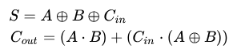

## Day 24: Crossed Wires

#### Part1
1. Add all the inputs signals on the board as independent active gate.
1. Build the board recursively by placing gates that depend only on inputs already present on the board.
2. Mark all gates as inactive initially
3. For each gate
    - Ensure that both inputs are active (i.e., their outputs have already been computed).
    - Compute the output of the current gate.
4. For all Zxx gate 
    - Extract the bit index.
    - Add `value(Zxx) << idx` to the total sum.

#### Part2
Here we need to make sure that the given input correctly implement the [Full adder](https://en.wikipedia.org/wiki/Adder_(electronics)) between two 45 bit number.

By using the following formula 

Zn = (Xn ⊕ Yn) ⊕ Cn-1
Cn = (Xn * Yn) + (Cn-1 * (Xn ⊕ Yn))

with C0 = (Xn * Yn)  

We can derive a series of rule.
  - AND:
      - `AND` gate can only be input to and `OR` gate 
      - `AND` gate cannot take other `AND` gate as input
  - XOR:
      - `XOR` gate can only be input to and `AND/XOR` gate
      - `XOR` gate cannot take `AND` gate as input
  - OR:
      - `OR` gate can only be input of `AND/XOR` gate 
      - `OR` gate can only take `AND` gate as input
  - `(Xn ⊕ Yn) ⊕ (x ⊕ x)` should always output a `Zxx` except for the last carry `z45` 
  - A gate with `Zxx` as its output cannot directly use `Xn or Yn` as inputs.

1. Look for gates that does not follow those rules.
